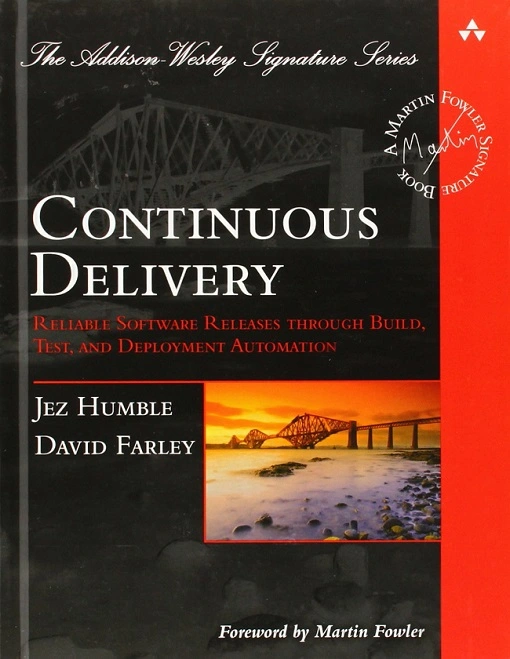

# Jenkins WorkShop

.footer: Created By Alex M. Schapelle, VAioLabs.io

---

# About The Course Itself ?

We'll learn several topics mainly focused on:

- What is CI/CD ?
- What is Jenkins ?
- How Jenkins works ?
- What are Jenkins pipelines ?
- How to manage docker in various scenarios ?

### Who Is This course for ?

- Junior/senior developers who wish to automate their development tasks.
- For junior/senior developers/devops/sysops who wish to learn CI/CD Basics with Jenkins as main tool.
- Experienced developers/devops who need refresher.

---

# Course Topics

- Intro
- CI/CD Basics
- Environment Setup
- Jenkins Tour
- Jobs
- Pipelines
- Integration With GitLab/Github
- Distributed Builds

---

# About Me

- Over 12 years of IT industry Experience.
- Fell in love with AS-400 unix system at IDF.
- 5 times tried to finish degree in computer science field
    - Between each semester, I tried to take IT course at various places.
        - Yes, one of them was A+.
        - Yes, one of them was Cisco.
        - Yes, one of them was RedHat course.
        - Yes, one of them was LPIC1 and Shell scripting.
        - No, others i learned alone.
        - No, not maintaining debian packages any more.
---

# About Me (cont.)
- Over 7 years of sysadmin:
    - Shell scripting fanatic
    - Python developer
    - Js admirer
    - Golang fallen
    - Rust fan
- 5 years of working with devops
    - Git supporter
    - Vagrant enthusiast
    - Ansible consultant
    - Container believer
    - K8s user

---

# About Me (cont.)

You can find me on the internet in bunch of places:

- Linkedin: [Alex M. Schapelle](https://www.linkedin.com/in/alex-schapelle)
- Gitlab: [Silent-Mobius](https://gitlab.com/silent-mobius)
- Github: [Zero-Pytagoras](https://github.com/zero-pytagoras)
- ASchapelle: [My Site](https://aschapelle.com)
- VaioLabs-IO: [My company site](https://vaiolabs.io)

---

# About You

Share some things about yourself:

- Name and Surname
- Job description
- What type of education do you poses ? formal/informal/self-taught/university/cert-course
- Do you know any of those technologies below ? What level ?
    - Docker / Docker-Compose / K8s
    - Jenkins
    - Git / GitLab / Github / Gitea / Bitbucket
    - Bash Script
    - Python3 / Pytest / Pylint / Flask
- Do you have any hobbies ?
- Do you pledge your alliance to [Emperor of Man kind](https://warhammer40k.fandom.com/wiki/Emperor_of_Mankind) ?

---

# History

In order to talk about Jenkins, we first need to explore some fundamental concepts which are:

- The software development life cycle (SDLC) 
- Continuous Integration and Continuous Delivery/Deployment (CI/CD)

---
# History (cont.)

## SDLC

The software development life cycle (SDLC) is a process for planning, creating, testing, and deploying an information system. The systems development life cycle concept applies to a range of hardware and software configurations, as a system can be composed of hardware only, software only, or a combination of both. There are usually six stages in this cycle: 

- Requirement analysis
- Design
- Development
- Testing
- Implementation
- Documentation
- Evaluation

---

# History (cont.)

## Problem with SDLC 

- No time estimate for any of SDLC stages
- Long time with requirement analysis will lead to delay in development
    - A solo app developer might move much more quickly here, testing out a hunch to see if there's a market for it
    - Big company might get stuck in decision making process in order not to tarnish their name
- Recourse allocation for each any stage
    - A solo developer will have to create all parts on his/her own
    - Big company will have advantage in this scenarios, yet organizational issue might also make it harder for them.

---

# History (cont.)

## Problem with SDLC (cont.)

- In SDLC model lines between different stages might overlap and blur, while working back and forth to find proper solution
- Design revisions might happen while Development is happening, to adjust for unexpected technical issues or enhancements suggested by the Development team.

In fact, all of these are fairly fluid in terms of `timing`. Integration and delivery had previously been very rigid events that didn't fit well into the flexible nature of the rest of the SDLC process.

---

# History (cont.)

## CI/CD

- __Continuous__  is defined as never ending as in looping endlessly.
- __Continuous integration__ is the practice of merging all developers' working copies to a shared mainline several times a day.
- __Continuous delivery__ is a software engineering approach in which teams produce software in short cycles, ensuring that the software can be reliably released at any time and, when releasing the software, without doing so manually.
- __Continuous deployment__ is a software engineering approach in which software functionalities are delivered frequently and through automated deployments.
- __CI/CD__ bridges the gaps between development and operation activities and teams by enforcing automation in building, testing and deployment of applications. CI/CD services compile the incremental code changes made by developers, then link and package them into software deliverables. 
- __Automated tests__ verify the software functionality, and automated deployment services deliver them to end users. 

---
# History (cont.)
## So what is the connection ?

CI/CD is a way of making those parts of the SDLC more adaptive and allows more back and forth across the entire process. 

The __aim__ is to increase early defect discovery, increase productivity, and provide faster release cycles. The process contrasts with traditional methods where a collection of software updates were integrated into one large batch before deploying the newer version. 

Modern-day DevOps practices involve continuous development, continuous testing, continuous integration, continuous deployment and continuous monitoring of software applications throughout its development life cycle. The CI/CD practice, or CI/CD pipeline, forms the backbone of modern day DevOps operations. 

---
# History (cont.)

## Jenkins

[Kohsuke Kawaguchi](https://en.wikipedia.org/wiki/Kohsuke_Kawaguchi) worked at Sun Microsystems on numerous projects for the Java, XML and Solaris ecosystems, notably as the primary developer for __Hudson__ project and for Multi Schema Validator. Project __Hudson__ was created in summer of 2004 and first released in February 2005.

During November 2010, after the acquisition of Sun Microsystems by Oracle, an issue arose in the Hudson community with respect to the infrastructure used, which grew to encompass questions over the stewardship and control by Oracle. Negotiations between the principal project contributors and Oracle took place, and although there were many areas of agreement a key sticking point was the trademarked name "Hudson," after Oracle claimed the right to the name and applied for a trademark in December 2010. As a result, on January 11, 2011, a call for votes was made to change the project name from __"Hudson"__ to __"Jenkins"__. The proposal was overwhelmingly approved by community vote on January 29, 2011, creating the Jenkins project.

---
# History (cont.)

On February 1, 2011, Oracle said that they intended to continue development of Hudson, and considered Jenkins a fork rather than a rename. Jenkins and Hudson therefore continued as two independent projects,each claiming the other is the fork. As of June 2019, the Jenkins organization on GitHub had 667 project members and around 2,200 public repositories, compared with Hudson's 28 project members and 20 public repositories with the last update in 2016.

On April 20, 2016 version 2 was released with the Pipeline plugin enabled by default. The plugin allows for writing build instructions using a domain specific language based on Apache **Groovy**.

