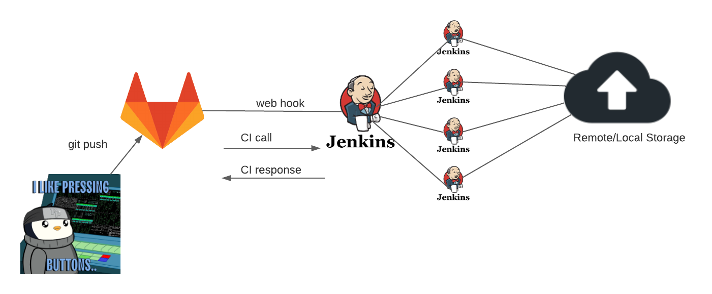

---

# Workshop Overview

---

# Let's Start With Basics

In order to gain most of this work shop :

- We'll setup __local lab__ for us to practice and understand bits and bytes of the __Jenkins__.
- BTW, Lab will be based on this project and [other project](https://gitlab.com/vaiolabs-io/jenkins-examples) material
- Use practical examples, to learn CI though the work shop
- Gain practice of deployment with version control

---
# What Will We Do ?

So what do we have in gist? Well main bullet points would be as follows:

- We'll start by going through Jenkins installation options
- Browse Jenkins essentials
- Describe Jenkins with internals and plugins
- Speak about Jobs, Build, Pipelines and beyond
- Setup tasks and run them locally
- Create repository for code management and integrate with __Jenkinsfile__
- Add build agents with various types deployments

---

# What Do We Need ?

- Essentially, our lab should to provide all we need, but it wouldn't hurt to have some experience with code and shell, running containers and also some understanding of CI.
- __Too much ?__ We'll go some of those anyway, but still it could be of help if you already have gitlab account outside of your company account.

---
# Developer Pipeline

This is a small representation of small development pipeline of single developer in cloud or on-prem environment

