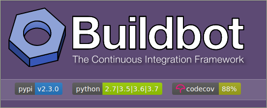
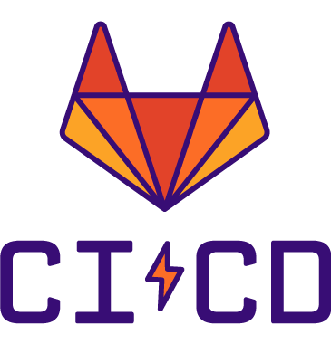

---

# What is Jenkins ?

---

# What is Jenkins ?

Jenkins is a tool for automation that provides continuous integration (CI) and continuous deployment/delivery (CD) pipeline

---

# Why Use Jenkins ?

Jenkins allows us to :

- Have full control over CI/CD
- Host Jenkins on prem and on cloud
- Run build and config scripts
    - In all include environments
    - Or any amount of environments
- Use tests on compiled or dynamic applications
- Manage build artifacts
- Decide whether to deploy applications
    - Or reject in case something went wrong
- Improve SDLC to make pipelines faster and more performant

---

# Other Alternatives

There a long list of alternatives, such as __gitlab-ci__, __github-actions__, __buildbot__ and so on, yet each and everyone of the have a long list of pros and cons of their own, but not all support the parts that Jenkins provide. One main thing to consider regarding Jenkins as oppose to alternatives would be the a great community and documentation.

- 
- 
- 

---
# Plugins Index

Jenkins possess a large amount of plugins. According to Jenkins community in 2022, amount of community based plugins stands around __1800__ and growing. Jenkins plugins are essentially extended code of jenkins that allows us to add to its functionality. For example, git plugin allows us to work on pipelines with git command options. Some of the plugins are major force for running Jenkins in any environment.
Yet, Plugins can also be achilles heel, because most of the plugins are maintained as open source, and if plugin is not maintained any more, due to various reasons, it can become major security/stability/performance issue.

---

# Jenkins Terms

- __Artifact__ : An immutable file generated during a Build or Pipeline run which is archived onto the Jenkins Controller for later retrieval by users
- __Build__ : Result of a single execution of a job
- __Continuous Integration__ : is the practice of merging all developers' working copies to a shared mainline several times a day
- __Continuous Delivery/Deployment__ :
- __Controller/Master__: The central, coordinating process which stores configuration, loads plugins, and renders the various user interfaces for Jenkins.
- __Worker/Slave__:
- __Job/project__ :  A user-configured description of work which Jenkins should perform, such as building a piece of software
- __Pipeline__ :  A user-defined model of a continuous delivery pipeline

---

# Jenkins Terms  (cont.)

- __Release__ : An event, indicating availability of Jenkins distribution products or one of Jenkins plugins
- __Stage__: is part of Pipeline, and used for defining a conceptually distinct subset of the entire Pipeline, for example: "Build", "Test", and "Deploy", which is used by many plugins to visualize or present Jenkins Pipeline status/progress.
- __Step__: A single task; fundamentally steps tell Jenkins what to do inside of a Pipeline or job. See Pipelines / Getting Started and Pipeline / Using a __Jenkinsfile__ for more info.
- __Trigger__: A criteria for triggering a new Pipeline run or job.
- __Testing__ : is a practice of checking build artifact after compilation or before deployment.
- __Workspace__ :  A disposable directory on the file system of a Node where work can be done by a Pipeline or job

---
# Jenkins Terms (cont.)

### Build Status

- __Aborted__: The Build was interrupted before it reaches its expected end. For example, the user has stopped it manually or there was a time-out.
- __Failed__: The Build had a fatal error.
- __Stable__: The Build was Successful and no Publisher reports it as Unstable.
- __Successful__: The Build has no compilation errors.
- __Unstable__: The Build had some errors but they were not fatal

