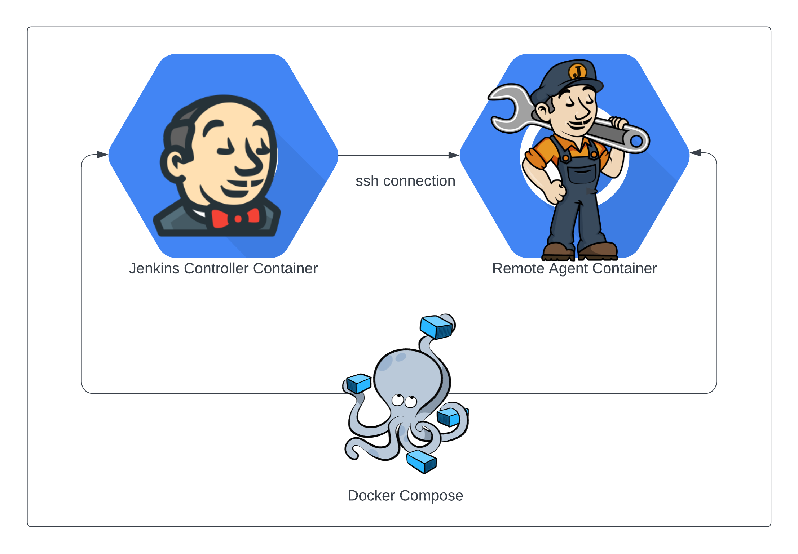

---

# Projects Description

---

# Projects Description

During this workshop we'll have several topics that we'll cover. To do so we'll need jenkins environment and also a [example application](https://gitlab.com/vaiolabs-io/jenkins-examples) that we'll cover later. For our Jenkins application we'll use container/docker based environment to simulate small jenkins cluster.
The simulated environment eventual architecture of our jenkins cluster, will look like as shown below:



> [!] Note: Please fork this project


---

# Project Description (cont.)

## Project Structure

```sh
jenkins-workshop/99_misc/setup
                            |
                            ` docker/
                                |-- Dockerfile.main
                                |-- Dockerfile.worker
                                |-- LICENSE
                                |-- README.md
                                |-- docker-compose.yml
                                |-- id_rsa
                                |-- id_rsa.pub
                                |-- init.sh
                                `-- setup.sh

```

