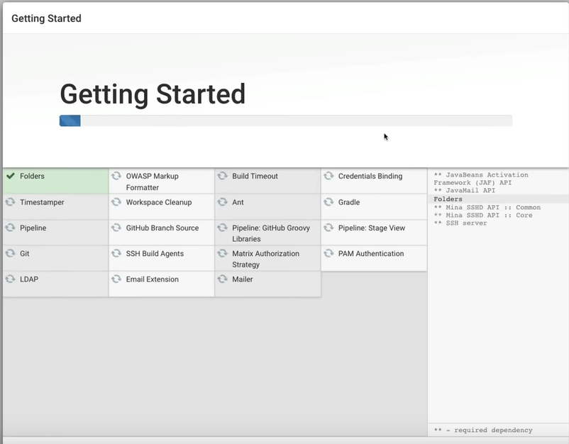
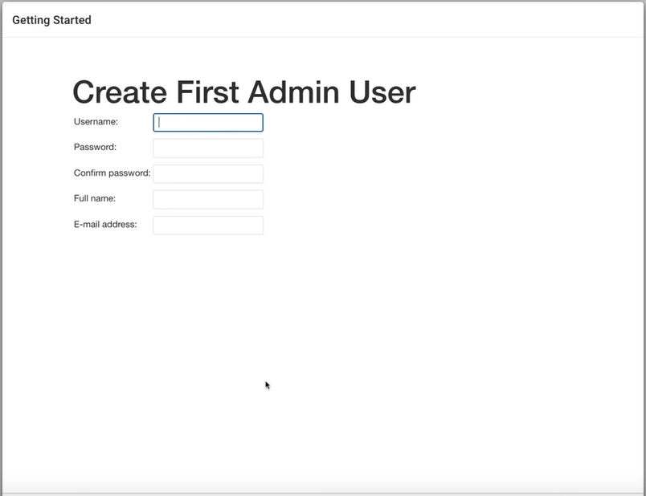
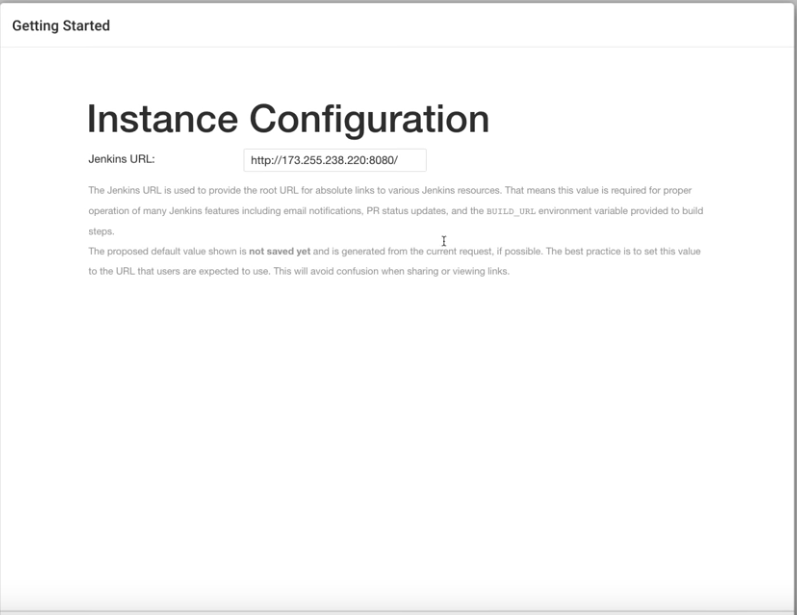
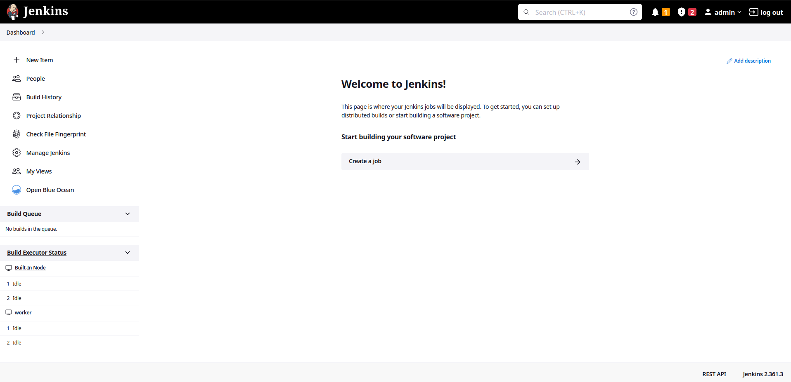

---

# Setting Lab

---

# Overview

There  various ways to install Jenkins, yet mostly used ones are:

- Docker
- Native OS: Linux or Windows
- Java install: Running packed WAR file to run.

> [!] Note:  We'll use Docker

---
# Setting Lab

To setup our play ground, we'll need this project, because it has docker and vagrant playground setups.
Lets start by cloning:

```sh
git clone https://gitlab.com/vaiolabs-io/jenkins-workshop.git 
cd jenkins-workshop/99_misc/setup/docker # if you are on strigo --> no need for this
./setup.sh # wait until it finishes --> it might need permissions
docker-compose up -d # wait for output to be printed
```

> [!] Note: if you are using __strigo__ with me, run only : `docker-compose up -d`

---

# Setting Lab (cont.)

Jenkins is used mostly by UI via browser, thus we need the IP or DNS name to access it. 
But before that, we'll need access key, which is printed in background while starting docker containers.
Thus we'll `logs` subcommand to see the key:

```sh
docker-compose logs
```


> [!] Note: Log to UI and enter the key when required


---

# Setting Lab (cont.)

Install **recommended** plugins and continue to next page




---
# Setting Lab (cont.)

Create user and save login details



> [!] Note: Please save the id and password, because jenkins like to log its users out on timeouts.

---

# Setting Lab (cont.)

After all that fiasco, We'll get instance configuration page, mostly used to configure DNS name, yet for our terms and use cases, we can leave  it as it is.




---

# Setting Lab (cont.)

Which leads us to finishing setup and to main jenkins page where we'll go through a quick tour.



---

# Summary Lab

- Please setup working lab according example provided.

