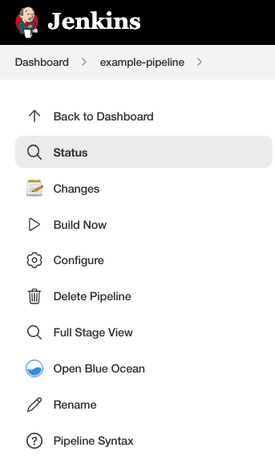
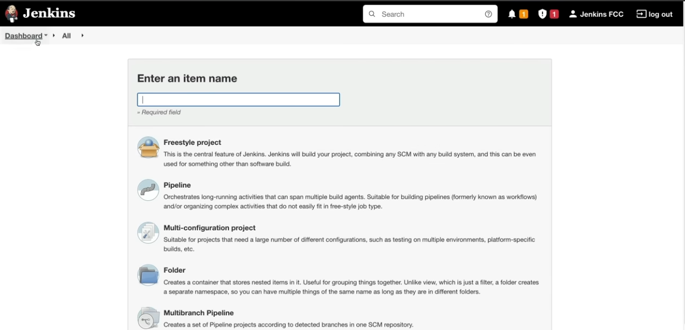
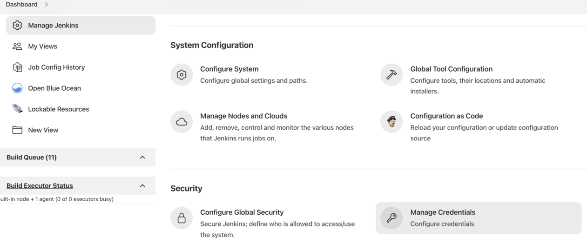

---

# Jenkins Interface Tour

---

# Jenkins Interface Tour

Here is a looks of fresh jenkins installation from our lab setup:

---
# Right Menu

---
# Left Menu

---
# New Item

---
# Manage Jenkins

---

# Jenkins Interface Tour (cont.)

