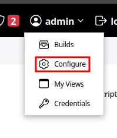
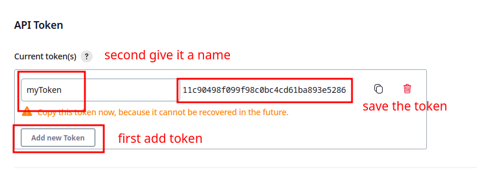

---

# Freestyle Jobs

---

# Freestyle Jobs

As the name implies, the `freestyle job` lets you freely control the way Jenkins manages the tasks that you want to automate. Nowadays these types of jobs are mainly  used for system administration automation. 
Freestyle jobs UI mainly contains :

- Description: area to provide description for project
- SCM management: connection to our source management system
- Build Triggers: actions that will start our jobs:
    - schedules
    - hooks
    - UI
- Build Environment: area where we can get you control over the space where the job will run and some steps to take when the job is actually running.
- Build : trigger to start the job via UI
- Post Actions: tasks to perform after the job is finished


---

# Practice

- Create freestyle job that runs python script that will count till 10 and sleep 2 seconds between each iteration.
- Run the job and follow over console output

---

# RestAPI calls for jobs

Calling jobs from CLI with curl can be done with various tools and programming languages, most popular of them being:
- bash/curl
- python-jenkins api library
- groovy programming language

In to provide access to jenkins with remote api call, we need security token. It generated at your users area under left side menu of `User -> configure -> api token`.
Below is the illustration.





>  Note: same can be done with credential management

---
# RestAPI calls for jobs (cont.)

Once Token has been generated and saved, we can go back to freestyle Job and Token to it. There, under __Build Trigger__ area, with choice options called __Trigger builds remotely (e.g., from scripts)__, we add our generated token and move back to our terminal to use `curl` command to run the __Freestyle job__

```sh
curl -I --user admin:admin  http://Jenkins-ip-address:8080/job/hello/build?token=12341244324213545235245235 
# use your token --> --user admin:YOUR_TOKEN_HERE 
```

> [!] Note: same can be done with pipeline and multi-branch jobs.

---

# Practice

- Create a freeStyle job that uses [sleep-sort](https://www.geeksforgeeks.org/sleep-sort-king-laziness-sorting-sleeping/) function in bash 
- Add token to the freestyle job.
- Run the job remotely with __curl__ command.
- Validate via console output that script is running

