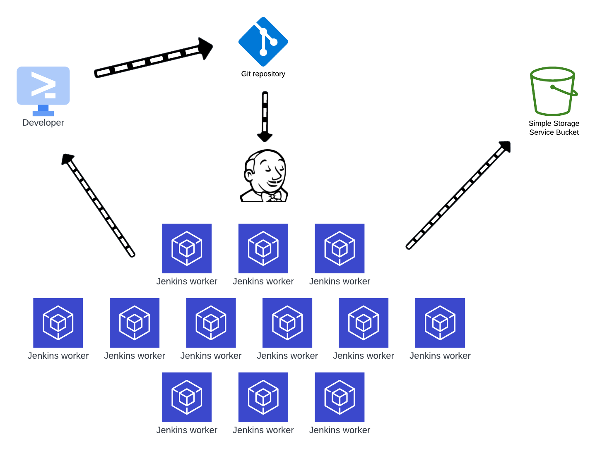

---

# Pipelines

---

--

# Pipelines

A Pipeline is a suite of plugins which supports implementing and integrating continuous delivery pipelines into Jenkins. A continuous delivery (CD) pipeline is an automated expression of your process for getting software from version control right through to your users and customers. Every change to your software (committed in source control) goes through a complex process on its way to being released. This process involves building the software in a reliable and repeatable manner, as well as progressing the built software (called a "build") through multiple stages of testing and deployment.


---

# Declarative vs. Scripted Pipeline Syntax

A Jenkins Pipeline can be written using two types of syntax - Declarative and Scripted. Declarative and Scripted Pipelines are constructed fundamentally differently. Declarative Pipeline is a more recent feature of Jenkins Pipeline which:

- provides richer syntactical features over Scripted Pipeline syntax
- it's designed to make writing and reading Pipeline code easier.

---

# Why Pipeline?

Jenkins is, fundamentally, an automation engine which supports a number of automation patterns. Pipeline adds a powerful set of automation tools onto Jenkins, supporting use cases that span from simple continuous integration to comprehensive CD pipelines. By modeling a series of related tasks, users can take advantage of the many features of Pipeline:

- __Code__: Pipelines are implemented in code and typically checked into source control, giving teams the ability to edit, review, and iterate upon their delivery pipeline
- __Durable__: Pipelines can survive both planned and unplanned restarts of the Jenkins controller.
- __Pauseable__: Pipelines can optionally stop and wait for human input or approval before continuing the Pipeline run.

---

# Why Pipeline? (cont.)

- Versatile: Pipelines support complex real-world CD requirements, including the ability to fork/join, loop, and perform work in parallel.
- Extensible: The Pipeline plugin supports custom extensions to its DSL [1] and multiple options for integration with other plugins.

While Jenkins has always allowed rudimentary forms of chaining Freestyle Jobs together to perform sequential tasks,  Pipeline makes this concept a first-class citizen in Jenkins

---


# Pipeline Concepts

The following concepts are key aspects of Jenkins Pipeline, which tie in closely to Pipeline syntax:

-  __Pipeline__ is a user-defined model of a CD pipeline. A Pipeline’s code defines your entire build process, which typically includes stages for building an application, testing it and then delivering it. Also, a pipeline block is a key part of Declarative Pipeline syntax.
-  __Node__ is a machine which is part of the Jenkins environment and is capable of executing a Pipeline. Also, a node block is a key part of Scripted Pipeline syntax.
-  __Stage__: defines a conceptually distinct subset of tasks performed through the entire Pipeline (e.g. "Build", "Test" and "Deploy" stages), which is used by many plugins to visualize or present Jenkins Pipeline status/progress. 
- __Step__ A single task. Fundamentally, a step tells Jenkins what to do at a particular point in time (or "step" in the process). For example, to execute the shell command make use the sh step: sh 'make'. When a plugin extends the Pipeline DSL, that typically means the plugin has implemented a new step.

---

# Pipeline Illustration
This illustration provides example of single developer working on small project with help of git server and Jenkins orchestration



---
# Before We Begin ...

Where ever pipelines come into conversation, they are usually referenced as a tool to orchestrate, integrate and deliver on existing software, and in this case there is no exception.
For our course we have developed a demo software saved at gitlab repository named [Jenkins Elementary](https://gitlab.com/vaiolabs-io/jenkins-examples)

In the project we have a flask framework based project. We will use __Jenkins__ to automate different tasks with __pipelines__ for this projects.
Lets' go over the project to see what we have there.

> [!] Note: Please fork [Jenkins Elementary](https://gitlab.com/vaiolabs-io/jenkins-examples) as well to your environment

---

# Now Back To Pipelines

---
# Declarative Pipeline Fundamentals

In Declarative Pipeline syntax, the pipeline block defines all the work done throughout your entire Pipeline.
Declarative Pipeline
```groovy
pipeline {
    agent any // Execute this Pipeline or any of its stages, on any available agent. 
    stages {
        stage('Build') {  //Defines the "Build" stage.
            steps {
                //  Perform some steps related to the "Build" stage
            }
        }
        stage('Test') { //Defines the "Test" stage.
            steps {
                //  Perform some steps related to the "Test" stage
            }
        }
        stage('Deploy') { //Defines the "Deploy" stage.
            steps {
                // Perform some steps related to the "Deploy" stage
            }
        }
    }
}
```
---

# Declarative Pipeline Fundamentals (cont.)
For purpose of our course we'll be suggesting some initial steps that we deem to be useful as part of best practice suggestion.
here is the pipeline that we would provide:
```groovy
pipeline{
    agent any
    stages{
        stage('PreBuild'){
            echo 'checking dependencies for the build'
            sleep 2
            // install dependencies for the project
            // not mandatory yet useful in cases where agents are dynamic and not properly configured: discussion ?!
        }
        stage('Lint'){
            echo 'checking and formatting the code'
            sleep 2
            // need to use code specific tool for checking static code analysis and format
        }
        stage('Build'){
            echo 'building the project'
            sleep 2
            // mainly used to compile binary or pack scripts in to executable
        }
```
---
# Declarative Pipeline Fundamentals (cont.)
```groovy
        stage('Test'){
            echo 'testing the code'
            sleep 2
            //using developers tests on existing and added coded binary/executable to see regression/sanity/glitches 
        }
        stage('Archive'){
            echo 'archiving the code'
            sleep 2
            // mostly used to save the binary/executable into compact format
        }
    }// There are changes that will come by
}

```
---

# Practice
- Create a pipeline with stages and tasks as follows below:
    - Prebuilt: install next list of packages
        - python3
        - python3-pip
        - python3-flask
        - pylint
        - pyinstaller
        - curl
        - wget
-  Linter for testing python code with pylint
-  Build step where you pack python application with pyinstaller
-  Test stage to test running application with curl
-  Archiving the created and packed application with `archive` stage
> [!] Note: you can find the python app [here](https://gitlab.com/vaiolabs-io/jenkins-examples.git)

---
# Creating A Jenkinsfile

As discussed in the Defining a Pipeline in SCM, a __Jenkinsfile__ is a text file that contains the definition of a Jenkins Pipeline and is checked into source control

```groovy
pipeline {
    agent any

    stages {
        stage('Build') {
            steps {
                echo 'Building..'
            }
        }
        stage('Test') {
            steps {
                echo 'Testing..'
            }
        }
        stage('Deploy') {
            steps {
                echo 'Deploying....'
            }
        }
    }
}
```

---
# Creating A Jenkinsfile (cont.)

Working with your __Jenkinsfile__

The following sections provide details about handling:

- specific Pipeline syntax in your __Jenkinsfile__ features and functionality of Pipeline syntax which are essential in building your application or Pipeline project.


---

# Workload Distribution

## Ssh connection setup

We'll dive into build agents later in deeper level, yet  we should differ our executions on to different executor to see how manual setups are done.

---

# Practice

- Connect jenkins master to to jenkins worker via ssh
    - Create a ssh key to connect with jenkins UI
    - Setup Jenkins workers tag
    - Set worker instance to use 4 threads
    - Verify connection
    - Disable master to run jobs and pipeline

---

# Using Environment Variables

Jenkins Pipeline exposes environment variables via the global variable env, which is available from anywhere within a __Jenkinsfile__. The full list of environment variables accessible from within Jenkins Pipeline is documented at $`https://jenkins-ip/env-vars.html` and some examples are:

- __BUILD_ID__: The current build ID, identical to BUILD_NUMBER for builds created in Jenkins versions 1.597+
- __BUILD_NUMBER__: The current build number, such as "153"
- __BUILD_URL__:    The URL where the results of this build can be found (for example http://buildserver/jenkins/job/MyJobName/17/ )

---
# Using Environment Variables (cont.)

- __JENKINS_URL__:    Full URL of Jenkins, such as https://example.com:port/jenkins/ (NOTE: only available if Jenkins URL set in "System Configuration")
- __JOB_NAME__ :   Name of the project of this build, such as "foo" or "foo/bar".
- __WORKSPACE__:    The absolute path of the workspace

---

# Using Environment Variables

Referencing or using these environment variables can be accomplished like accessing any key in a Groovy Map, for example:
```groovy
pipeline {
    agent any
    stages {
        stage('Example') {
            steps {
                echo "Running ${env.BUILD_ID} on ${env.JENKINS_URL}"
            }
        }
    }
}

```
> [!] Note: you can find all environment variables at `https://jenkins-ip/env-vars.html`

---

# Practice 

- Use existing jenkins pipeline and print on each run :
    - The branch name
    - The build id
    - The build url

---

# Pipelines with parameters

Jenkins pipelines can declare what kind of parameters it accepts and what are the defaults to those parameters
```groovy
pipeline {
    agent any
    parameters {
       string(name: 'comics', defaultValue: 'DC', description: 'name of preferred comics brand')
       booleanParam(name: 'yesno', defaultValue: false, description: 'Checkbox')
       choice(name: 'hero', choices: ['Batman', 'Superman', 'WonderWoman', 'HarleyQuinn'], description:  'Pick a hero')
       choice(name: 'villain', choices: ['Joker', 'LexLuthor', 'Cheetah', 'MentalHealth'], description:  'Pick a villain. Defaults to empty string')
       password(name: 'secret', defaultValue: '', description: 'Type some secret')
    }

```
 > [!] Note: there is a code continuum on the next page

---

# Pipelines with parameters (cont.)

```groovy
        stages {
            stage('Example') {
                steps {
                    echo params.comic
                    echo params.yesno ? "yes" : "no"
                    echo params.hero
                    echo params.villain
                    //echo params.secret
                    echo "--------"
                    echo "${params.comic}"
                    echo "${params.yesno}"
                    echo "${params.comic}"
                    echo "${params.villain}"
                    echo "${params.secret}"
                    script {
                        sh "echo ${params.secret}"
                }
            }
        }
    }
}
```

---

# Practice

- Edit existing pipeline to have `sleep_time` parameter that is passed to jenkins which is passed on the run


---
# Post

The `post` section defines one or more additional steps that are run upon the completion of a Pipeline’s or stage’s run.
`post` can support any of the following `post-condition blocks`, listed below. These condition blocks allow the execution of steps inside each condition depending on the completion status of the Pipeline or stage. The condition blocks are executed in the order shown below.


---

# Post (cont.)


- __always__: Run the steps in the post section regardless of the completion status of the Pipeline’s or stage’s run.
- __changed__: Only run the steps in post if the current Pipeline’s run has a different completion status from its previous run.
- __fixed__: Only run the steps in post if the current Pipeline’s run is successful and the previous run failed or was unstable.
- __regression__: Only run the steps in post if the current Pipeline’s or status is failure, unstable, or aborted and the previous run was successful.
- __aborted__: Only run the steps in post if the current Pipeline’s run has an "aborted" status, usually due to the Pipeline being manually aborted. This is typically denoted by gray in the web UI.
- __failure__: Only run the steps in post if the current Pipeline’s or stage’s run has a "failed" status, typically denoted by red in the web UI.


---

# Post (cont.)

- __success__: Only run the steps in post if the current Pipeline’s or stage’s run has a "success" status, typically denoted by blue or green in the web UI.
- __unstable__: Only run the steps in post if the current Pipeline’s run has an "unstable" status, usually caused by test failures, code violations, etc. This is typically denoted by yellow in the web UI.
- __unsuccessful__: Only run the steps in post if the current Pipeline’s or stage’s run has not a "success" status. This is typically denoted in the web UI depending on the status previously mentioned (for stages this may fire if the build itself is unstable).
- __cleanup__: Run the steps in this post condition after every other post condition has been evaluated, regardless of the Pipeline or stage’s status.

> [!] Notes:
>   - Conventionally, the post section should be placed at the end of the Pipeline.
>   - Post-condition blocks contain steps the same as the steps section.

---

# Example

```groovy


pipeline {
    agent any
    stages {
        stage('Example') {
            steps {
                echo 'Hello World'
            }
        }
    }
    post { 
        always { 
            echo 'I will always say Hello again!'
        }
    }
}


```


---
# Practice

- Add to existing pipeline an `post` stage:
    - In case of unsuccess, clean up the working directory
    - In case of success, artifact the the converted application in to the project
    - Bonus: zip/tar the converted app before archiving

---
# Conditioning
## When


The when directive allows the Pipeline to determine whether the stage should be executed depending on the given condition. The when directive must contain at least one condition. If the when directive contains more than one condition, all the child conditions must return true for the stage to execute. This is the same as if the child conditions were nested in an allOf condition (see the examples below). If an anyOf condition is used, note that the condition skips remaining tests as soon as the first "true" condition is found.

More complex conditional structures can be built using the nesting conditions: not, allOf, or anyOf. Nesting conditions may be nested to any arbitrary depth.


---
# Example 

```groovy 


pipeline {
    agent any
    stages {
        stage('Example Build') {
            steps {
                echo 'Hello World'
            }
        }
        stage('Example Deploy') {
            when {
                branch 'production'
            }
            steps {
                echo 'Deploying'
            }
        }
    }
}


```

---
# Practice

- Edit existing pipeline with addition stage named 'Pack the binary'
    - The needs to run only when on that specific branch
    - During the stage compress the binary 
    - Add to post, archiving the binary the file

---

# Parallel


Stages in Declarative Pipeline may have a parallel section containing a list of nested stages to be run in parallel. Note that a stage must have one and only one of steps, stages, parallel, or matrix. It is not possible to nest a parallel or matrix block within a stage directive if that stage directive is nested within a parallel or matrix block itself. However, a stage directive within a parallel or matrix block can use all other functionality of a `stage`, `including agent`, `tools`  and etc.

In addition, you can force your parallel stages to all be aborted when any one of them fails, by adding failFast true to the stage containing the parallel. Another option for adding `failfast` is adding an option to the pipeline definition: parallelsAlwaysFailFast()


---
# Example 

```groovy


pipeline {
    agent any
    stages {
        stage('Non-Parallel Stage') {
            steps {
                echo 'This stage will be executed first.'
            }
        }
        stage('Parallel Stage') {
            when {
                branch 'master'
            }
            failFast true
            parallel {
                stage('Branch A') {
                    agent {
                        label "for-branch-a"
                    }
                    steps {
                        echo "On Branch A"
                    }
                }
                stage('Branch B') {
                    agent {
                        label "for-branch-b"
                    }
                    steps {
                        echo "On Branch B"
                    }
                }
                stage('Branch C') {
                    agent {
                        label "for-branch-c"
                    }
                    stages {
                        stage('Nested 1') {
                            steps {
                                echo "In stage Nested 1 within Branch C"
                            }
                        }
                        stage('Nested 2') {
                            steps {
                                echo "In stage Nested 2 within Branch C"
                            }
                        }
                    }
                }
            }
        }
    }
}


```

---

# Practice


---

# Tools

A section defining tools to auto-install and put on the PATH. This is ignored if agent none is specified

> [!] Note: The tool name must be pre-configured in Jenkins under `Manage Jenkins -> Global Tool Configuration`.


---

# Practice


---

# Summary Practice

<!-- there is also some place to talk about scripted pipelines -->